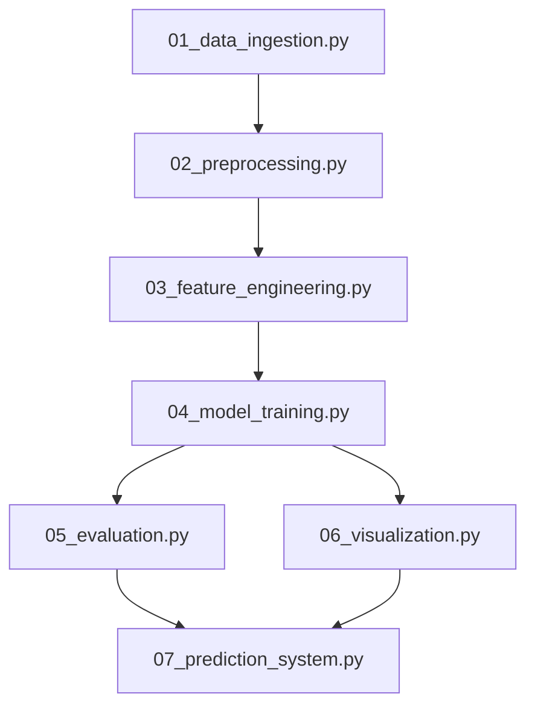

# EV Battery Analysis & Prediction System Architecture

This document outlines the complete architecture and workflow pipeline for the EV Battery Analysis & Prediction System. The project is designed sequentially, with each stage taking inputs from the previous stage to build robust machine learning models for predicting State of Charge (SOC), State of Health (SOH), Remaining Useful Life (RUL), and Mileage per Charge.

## 🏗 Workflow Pipeline Overview

The entire pipeline is divided into seven core modules, organized sequentially:

### 1. Data Ingestion (`01_data_ingestion.py`)
- **Objective:** Collect and load raw data from various sources.
- **Process:** Reads OEM telemetry, device telemetry, trip records, and charge cycles from the `Raw Data` directory.
- **Output:** Raw dataframes ready for preprocessing.

### 2. Preprocessing (`02_preprocessing.py`)
- **Objective:** Clean and format raw data to prepare for feature extraction.
- **Process:** Handles missing values, performs data type conversions, and standardizes data formats. It securely decouples data to prevent any data leakage.
- **Output:** Cleaned datasets stored in `processed_data/` for the next stage.

### 3. Feature Engineering (`03_feature_engineering.py`)
- **Objective:** Create meaningful features that map to the underlying causes of battery degradation and performance.
- **Process:** 
  - Generates trip-based features (e.g., `energy_efficiency`, `trip_intensity`).
  - Generates telemetry and hardware features (e.g., `voltage_deviation`, `temp_stress_index`).
  - Derives long-term degradation signals (e.g., `degradation_factor`).
  - Actively drops direct proxy variables (like `soc_drain`) to force models to learn underlying patterns (Data Leakage Prevention).
- **Output:** Fully engineered and enriched datasets ready for training.

### 4. Model Training (`04_model_training.py` & `retrain_clean.py`)
- **Objective:** Train predictive models across all four tasks (SOC, SOH, RUL, Mileage).
- **Process:**
  - Performs train-test splitting and cross-validation.
  - Trains Classical Machine Learning models (Random Forest, XGBoost, Extra Trees, etc.).
  - Trains Deep Learning architectures (LSTM, GRU, CNN-1D, etc.).
  - Executes Randomized Search CV for hyperparameter tuning.
- **Output:** Trained model artifacts saved to the `models/` directory.

### 5. Evaluation (`05_evaluation.py`)
- **Objective:** Assess model performance to identify the best predictors for each task.
- **Process:** Computes evaluation metrics such as RMSE, MAE, R², and MAPE. Evaluates classical vs. deep learning models.
- **Output:** Evaluation reports and selection of the champion models (e.g., Random Forest for SOC/RUL, Extra Trees for SOH, XGBoost for Mileage).

### 6. Visualization (`06_visualization.py`)
- **Objective:** Provide visual insights into model performance and feature importance.
- **Process:** 
  - Generates loss/accuracy curves.
  - Plots predicted vs. actual values.
  - Uses SHAP values to explain feature importance and model decision-making.
- **Output:** Graphs and charts saved to the `results/` or `logs/` directory.

### 7. Prediction System (`07_prediction_system.py`)
- **Objective:** Operationalize the trained models for real-time or batch predictions.
- **Process:** Loads the best models from the `models/` directory, takes in new telemetry or trip data, and outputs the predicted SOC, SOH, RUL, and Mileage.
- **Output:** Actionable predictions for the end user or battery management system.

## 🛡 Key Architecture Principles
- **Data Leakage Prevention:** The system rigorously drops direct algebraic derivations (e.g. `soc_drain_rate` for mileage prediction) ensuring causal learning instead of simple mapping.
- **Model Versatility:** Evaluates an extensive array of classical and deep learning models to identify the empirically superior algorithm for each tabular subset.
- **Modularity:** Each script (`01` through `07`) can be executed independently given the required input artifacts, enabling streamlined updates and targeted debugging.
