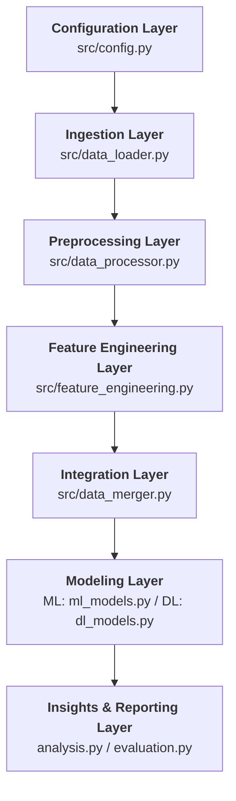
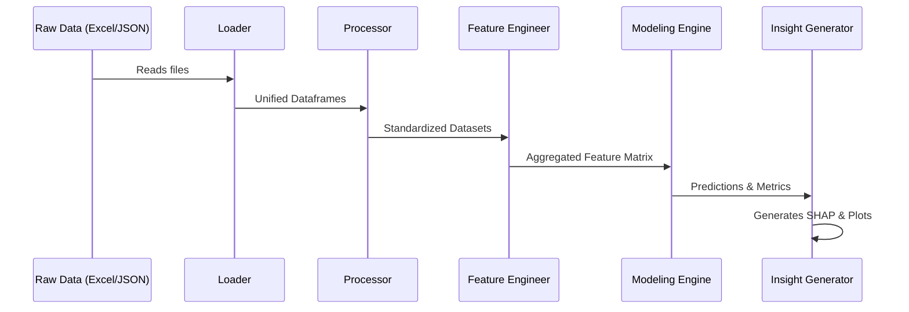

# Master Module Architecture: EV Battery Degradation & BA-BMS

This document provides a comprehensive technical blueprint of the project's software architecture. The system is designed as a **modular research pipeline** that translates raw vehicle telemetry into explainable battery health insights.

---

## 1. High-Level Architectural Layers

The system is organized into **seven distinct layers**, each with a specific responsibility in the data-to-insight lifecycle.

---

## 2. Detailed Module Breakdown

### 📂 Configuration Layer
*   **Module**: [`src/config.py`](file:///c:/Users/Devanshu/OneDrive/Documents/Final_Year_Project_1_akshat/src/config.py)
*   **Role**: The "Single Source of Truth" for the entire pipeline.
*   **Responsibility**: Defines global file paths, Behavioral Index weights (AI/BSI), model hyperparameters, and random seeds to ensure reproducibility across all experiments.

### 📂 Ingestion Layer
*   **Module**: [`src/data_loader.py`](file:///c:/Users/Devanshu/OneDrive/Documents/Final_Year_Project_1_akshat/src/data_loader.py)
*   **Role**: Raw Data Gateway.
*   **Responsibility**: Loads multi-format data (Excel, JSON, JSON-Stream). It is optimized to stream large telemetry files (350MB+) to prevent memory overflow on standard machines.

### 📂 Preprocessing Layer
*   **Module**: [`src/data_processor.py`](file:///c:/Users/Devanshu/OneDrive/Documents/Final_Year_Project_1_akshat/src/data_processor.py)
*   **Role**: Data Sanitation Engine.
*   **Responsibility**: Standardizes heterogeneous column schemas, normalizes vehicle identities, converts time-durations into numeric minutes, and handles datetime synchronization across diverse sensors.

### 📂 Feature Engineering Layer
*   **Module**: [`src/feature_engineering.py`](file:///c:/Users/Devanshu/OneDrive/Documents/Final_Year_Project_1_akshat/src/feature_engineering.py)
*   **Role**: Behavioral Analytics Core.
*   **Responsibility**: Calculates the **Driver Aggressiveness Index (AI)** and **Battery Stress Index (BSI)**. It transforms raw event counts into actionable "Behavioral Signatures" for each vehicle.

### 📂 Integration Layer
*   **Module**: [`src/data_merger.py`](file:///c:/Users/Devanshu/OneDrive/Documents/Final_Year_Project_1_akshat/src/data_merger.py)
*   **Role**: Holistic Data Synthesizer.
*   **Responsibility**: Performs vehicle-level joins across all datasets. Implements **Leakage-Free Imputation** (computing medians from training folds only) and constructs the final `final_merged_dataset.csv`.

### 📂 Modeling Layer
*   **Modules**: [`src/ml_models.py`](file:///c:/Users/Devanshu/OneDrive/Documents/Final_Year_Project_1_akshat/src/ml_models.py) & [`src/dl_models.py`](file:///c:/Users/Devanshu/OneDrive/Documents/Final_Year_Project_1_akshat/src/dl_models.py)
*   **Role**: Predictive Intelligence.
*   **Responsibility**: 
    *   **ML**: Trains and compares 9 regression models (XGBoost, LightGBM, Random Forest, etc.).
    *   **DL**: Implements sequential architectures (LSTM, CNN-LSTM) to capture temporal degradation patterns over time.

### 📂 Insights & Reporting Layer
*   **Modules**: [`src/analysis.py`](file:///c:/Users/Devanshu/OneDrive/Documents/Final_Year_Project_1_akshat/src/analysis.py) & [`src/evaluation.py`](file:///c:/Users/Devanshu/OneDrive/Documents/Final_Year_Project_1_akshat/src/evaluation.py)
*   **Role**: Explainable AI (XAI) & Validation.
*   **Responsibility**: Generates SHAP importance plots, comparative driver behavior reports, SOH distribution heatmaps, and the final model comparison tables.

---

## 3. End-to-End Data Flow

---

## 4. Technological Stack

*   **Logic & Analysis**: Python 3.10+, Pandas, NumPy, SciPy
*   **Machine Learning**: Scikit-Learn, LightGBM, XGBoost, CatBoost
*   **Deep Learning**: PyTorch (Sequential LSTM modeling)
*   **Explainability**: SHAP (SHapley Additive exPlanations)
*   **Visualization**: Matplotlib, Seaborn
